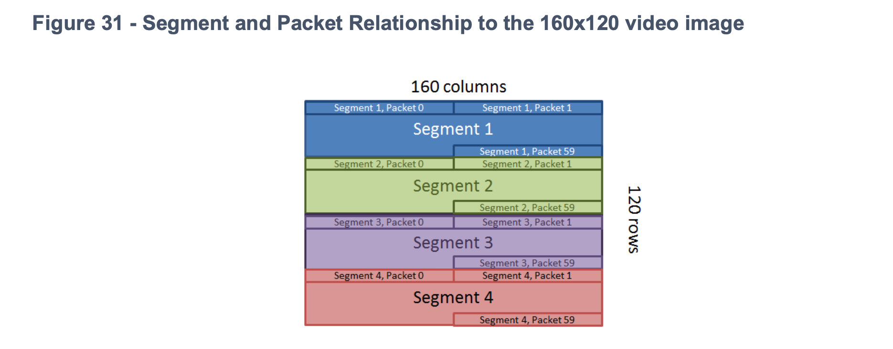
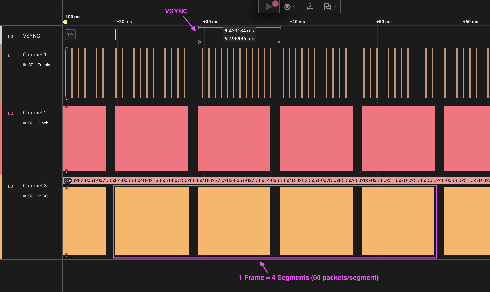

# STM_NucleoF446RE_Lepton35

STM32 Nucleo-F446RE BareMetal project using FLIR Lepton 3.5.

## TIPS
### Terminology
- **frame** – single thermal image (consist of 4 segments)
- **segment** – group of packets (60 packets per segment)
- **packet** – smallest unit of thermal image (164 bytes or 244 bytes based on selected video format)

### BreakoutBoard2.0
In this project, I used [FLIR Lepton Breakout Board v2.0](Docs/BreakoutBoard_2_DS.pdf). It does't mention in the specification but there is also another VIN/GND pin next to the sensor socket, please don't to wire it as well. Details in [GETTING STARTED WITH THE RASPBERRY PI AND BREAKOUT BOARD V2.0](Docs/getting-started-with-the-raspberry-pi-and-breakout-board-v2.pdf).

### VSYNC

VSYNC notifies you when it is ready to read data. For Lepton 2, you need to read full frame data before next VSYNC triggers. But for Lepton 3, 1 vsync indicates 1 segment readiness, you need to read 4 times to construct one image. As far as I checked, VSYNC in Lepton3.5 triggers every 9.4 ms.

### Discard packet

Not only Discard Packet, there is also a case that segment is zero. It seems like we need to discard this packet as well.

### Lepton SDK Issue

You can download the official Lepton SDK on the internet ([link](https://teledyne.app.box.com/s/joj0dgmug054oowh84x35rn9zcs4077v)).

But there is an issue that it returns LEP_RANGE_ERROR when changing its configuration via I2C. It was because, enum is expected to be 4 bytes in SDK but compiler was treating the enum as 2 bytes in STM32 IDE. Therefore, I have manually specified `= 65540` for the last enum value to force the compiler to use a 32-bit integer ([code](https://github.com/dblwhy/STM_NucleoF446RE_Lepton35/blob/master/Drivers/LeptonSDKEmb32OEM/LEPTON_VID.h#L261)). Maybe there is a smarter way to achieve this...:)
